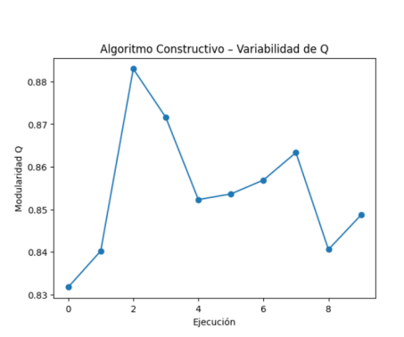
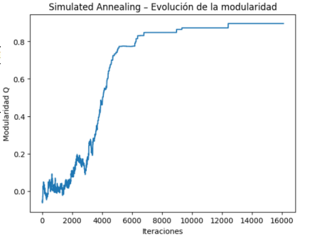
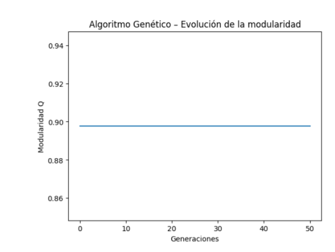

# Community Detection with Heuristic and Metaheuristic Algorithms

Heuristic and metaheuristic approaches (GRASP, Simulated Annealing, Genetic Algorithms) for community detection in complex networks.

---

## Overview

This project addresses the **Community Detection Problem (CDP)** in complex networks, with the objective of identifying groups of nodes (communities) that are more densely connected internally than externally.

The project is structured in two phases:

* **Sprint 1 — Problem formulation**
* **Sprint 2 — Heuristic optimization and experimental evaluation**

The focus is on understanding both the **theoretical foundations** and the **practical performance** of different optimization strategies.

---

## Problem Formulation (Sprint 1)

### Objective Function: Modularity

The goal is to maximize **modularity (Q)**, which measures the quality of a partition of a graph into communities.

```math
Q = \frac{1}{2m} \sum_{i,j} \left[ A_{ij} - \frac{k_i k_j}{2m} \right] \delta(c_i, c_j)
```

Where:

* ( A_{ij} ): weight of the edge between nodes ( i ) and ( j )
* ( k_i, k_j ): degrees of nodes
* ( m ): total weight of the graph
* ( \delta(c_i, c_j) ): 1 if both nodes belong to the same community

A higher value of ( Q ) indicates a better community structure.

---

### Community-based formulation

In practice, the following aggregated version is used:

```math
Q = \sum_{c \in C} \left( \frac{L_c}{m} - \left( \frac{D_c}{2m} \right)^2 \right)
```

Where:

* ( L_c ): internal edge weight of community ( c )
* ( D_c ): sum of degrees in community ( c )

---

### Solution Representation

Each solution is represented as:

```math
c = [c_1, c_2, ..., c_n]
```

Where each value indicates the community assignment of a node.

---

### Search Space Complexity

The number of possible partitions is given by the **Stirling number of the second kind**:

```math
S(n, k) = \frac{1}{k!} \sum_{i=0}^{k} (-1)^i \binom{k}{i} (k-i)^n
```

This highlights the combinatorial complexity of the problem.

---

### Baseline: Random Search

| Iterations | Best Q | Mean Q | Std Dev | Time (s) |
| ---------- | ------ | ------ | ------- | -------- |
| 100        | 0.107  | -0.004 | 0.033   | 0.187    |
| 1000       | 0.118  | -0.004 | 0.033   | 1.898    |
| 5000       | 0.164  | -0.005 | 0.033   | 11.32    |

These results show that uninformed search is inefficient for this problem.

---

## Heuristic Algorithms (Sprint 2)

To improve performance, three different approaches were implemented:

* **GRASP (Greedy Randomized Adaptive Search Procedure)**
* **Simulated Annealing (SA)**
* **Genetic Algorithm (GA)**

Each represents a different search paradigm:

* Constructive
* Local search
* Population-based

---

## Results and Analysis

### GRASP — Variability across executions



GRASP produces stable solutions with low variability, showing robustness despite randomness.

---

### Simulated Annealing — Convergence behavior



Simulated Annealing exhibits a clear exploration–exploitation pattern:

* Early exploration
* Gradual convergence toward better solutions

---

### Genetic Algorithm — Evolution dynamics



The Genetic Algorithm rapidly converges to high-quality solutions due to:

* strong initial population
* elitism strategy

---

## Quantitative Comparison

| Algorithm           | Mean Q | Std Dev | Best Q | Computational Cost |
| ------------------- | ------ | ------- | ------ | ------------------ |
| Random Search       | 0.15   | 0.02    | 0.18   | Low                |
| GRASP               | 0.72   | 0.03    | 0.75   | Low                |
| Simulated Annealing | 0.82   | 0.05    | 0.86   | Medium             |
| Genetic Algorithm   | 0.88   | 0.01    | 0.89   | High               |

---

## Key Insights

* Random Search is ineffective due to the size of the search space
* GRASP provides a strong balance between quality and efficiency
* Simulated Annealing improves results by escaping local optima
* Genetic Algorithm achieves the best performance, at higher computational cost

---

## Trade-off Analysis

More advanced algorithms achieve better modularity scores, but require higher computational effort.
This highlights the importance of selecting the appropriate method depending on constraints and objectives.

---

## Project Structure

```
report/
  ├── sprint1_problem_formulation.pdf
  └── sprint2_algorithms_and_results.pdf

notebooks/
  └── cdp_experiments.ipynb

results/
  ├── grasp_variability.png
  ├── simulated_annealing_curve.png
  └── genetic_algorithm_convergence.png
```

---

## Tech Stack

Python · NumPy · Network Analysis · Optimization Algorithms

---

## Notes

This project was developed as part of a university assignment, with a focus on understanding heuristic and metaheuristic optimization techniques in graph-based problems.
